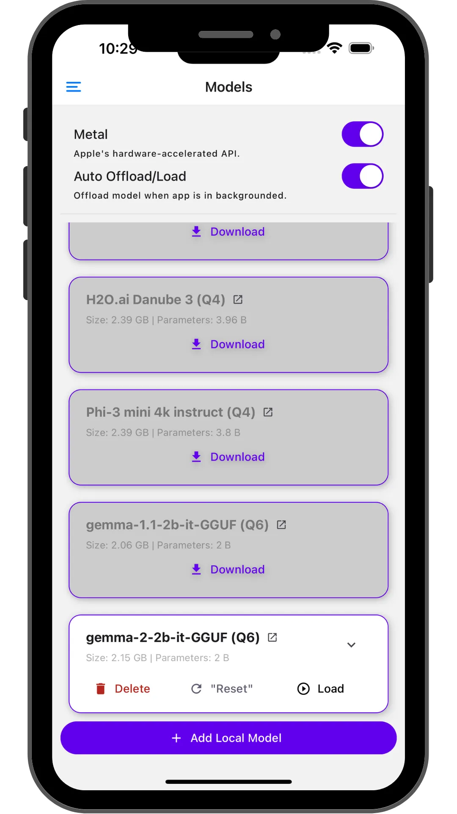
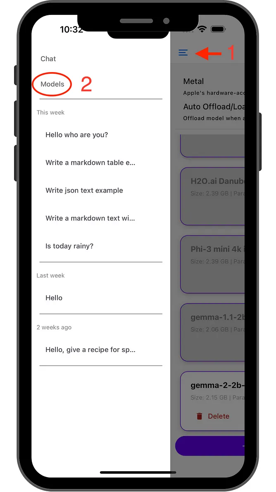
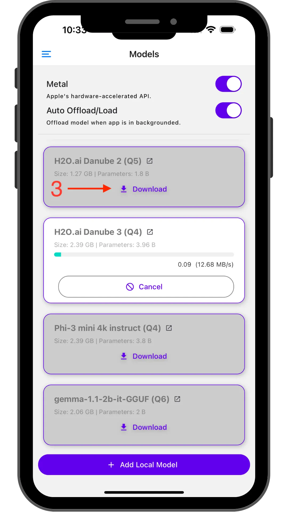
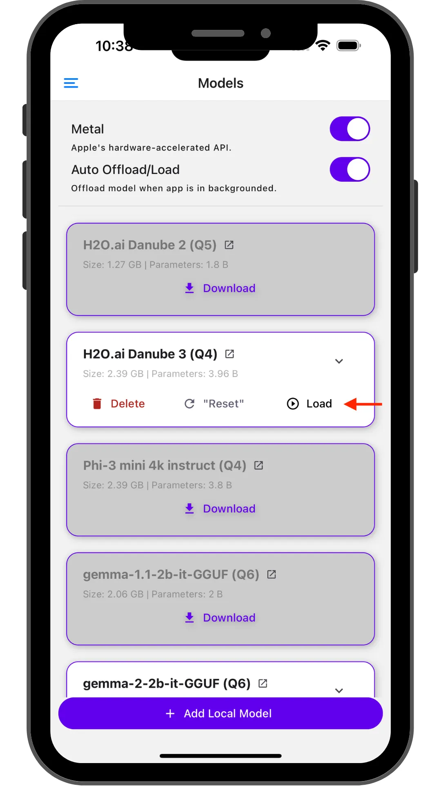
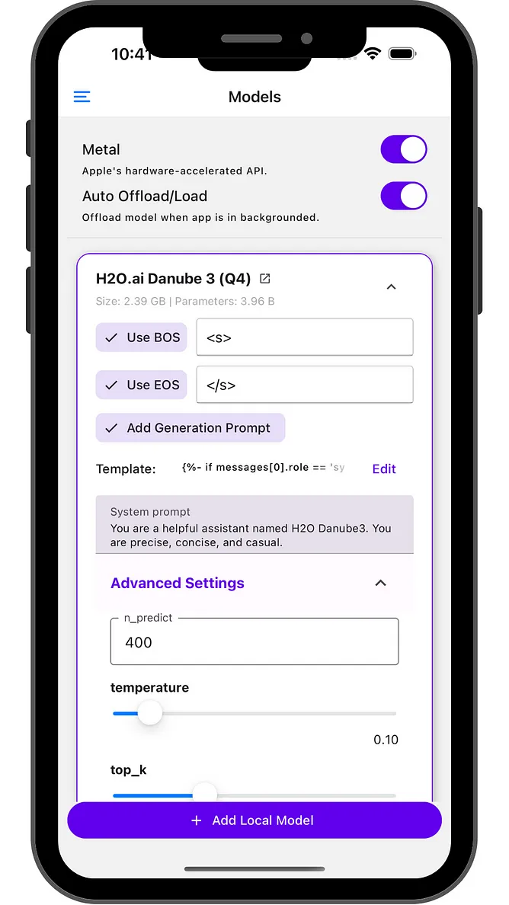
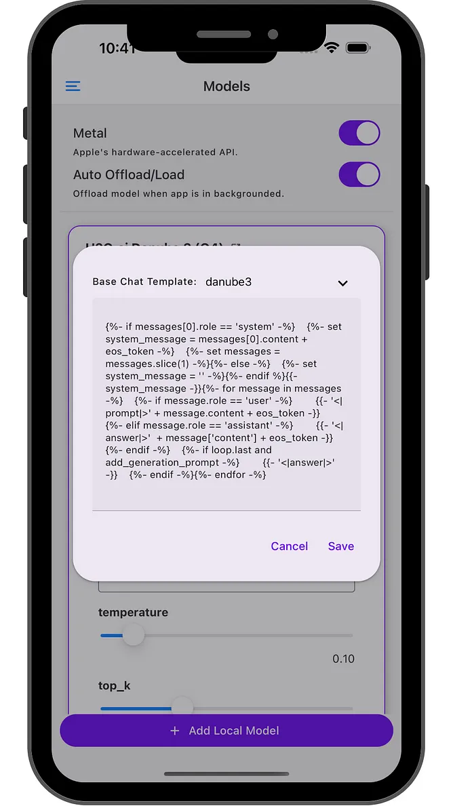
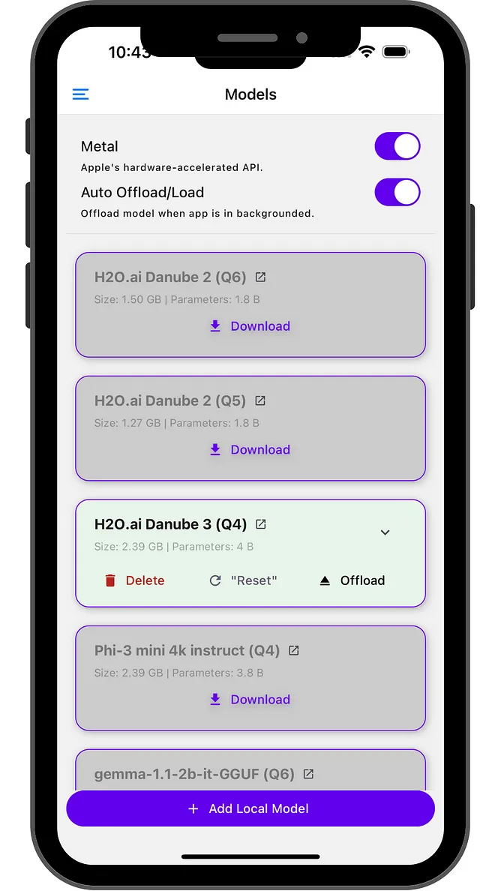
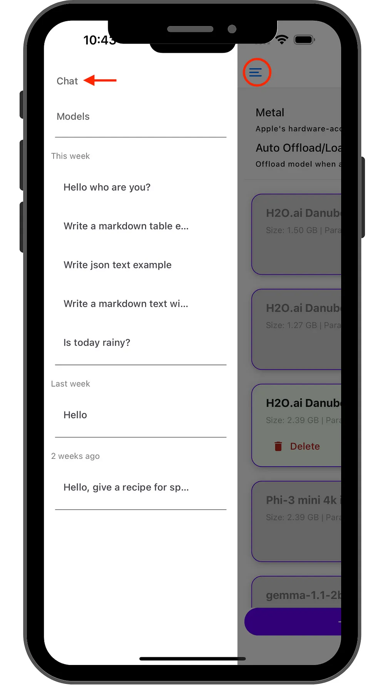
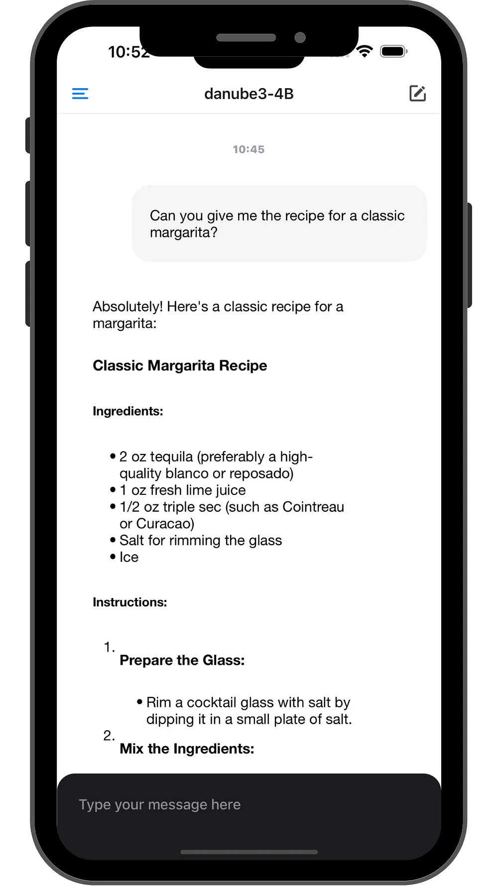

# Getting Started

Note: Part of this guide is outdated. It will be updated soon.

## Installation

**iPhone** users can grab it here: [PocketPal AI on the App Store](https://apps.apple.com/us/app/pocketpal-ai/id6502579498)

**Android** users can get it from here: [PocketPal AI on Google Play](https://play.google.com/store/apps/details?id=com.pocketpalai)

Note: This is a personal project, so I am working on it in my spare time. It might have bugs and issues, and obviously, I have not tested it on all devices. If you encounter any issues, open an issue, or even better, contribute to the project!

### Available Models
PocketPal AI comes pre-configured with some popular SLMs:

- Danube 2 and 3
- Phi
- Gemma 2
- Qwen

Modells need to be downloaded before use. You can download and use these models directly from the app and load any other GGUF models you like!

    

## Using PocketPal AI

### Downloading a Model

- Tap the burger menu
- Navigate to the “Models” page
- Choose your desired model and hit download

    
    
    

### Loading a Model
After downloading, tap *Load* to bring the model into memory. Now you’re ready to chat!

### Tips

On iOS devices, Apple’s GPU API (Metal) is activated by default. If you experience any hiccups, try deactivating it.

#### iOS Metal

#### Auto Offload/Load

To keep the device running smoothly, PocketPal AI can automatically manage memory usage:

- Enable “Auto Offload/Load” on the model page (by default it is)
- The app will offload the model when in the background
- It’ll reload when you return (give it a few seconds for larger models)

#### Advanced Settings

Click the chevron icon to access advanced LLM settings like:

- Temperature
- BOS token
- Chat template options
- etc.

    
    
    

### Finally, Let’s Chat!

Once your model is loaded, head to the “Chat” page and start conversing with the loaded model!

The generation performance metric is also displayed. If interested, watch the chat bubble for real-time performance metrics: Tokens per second and Milliseconds per token.

    
    

### Copying Text

Important Note: As of now, I haven’t found an easy way to select and copy text from the generated responses while preserving the text formatting, particularly Markdown support.

In the meantime, here are the current options for copying text:
- Paragraph-level copying: Long-press on a specific paragraph to copy its content.
- Full response copying: Use the copy icon at the bottom of the text bubble to copy the entire AI-generated response.

I know these options might not be ideal, and this is one of my frustrations with using other apps. The difficulty of copying portions of text used to be a particularly annoying aspect of chat apps like ChatGPT and others.

**Developers**: PocketPal AI is built using React Native. Finding an easy solution that balances text selection with preserved formatting (especially Markdown support) has been tricky for me. If you have experience in this area, I’d love to hear from you!

## Feedback Welcome!

If you have suggestions for new models or features, please let us know by creating an issue.

Happy exploring! 🚀📱✨